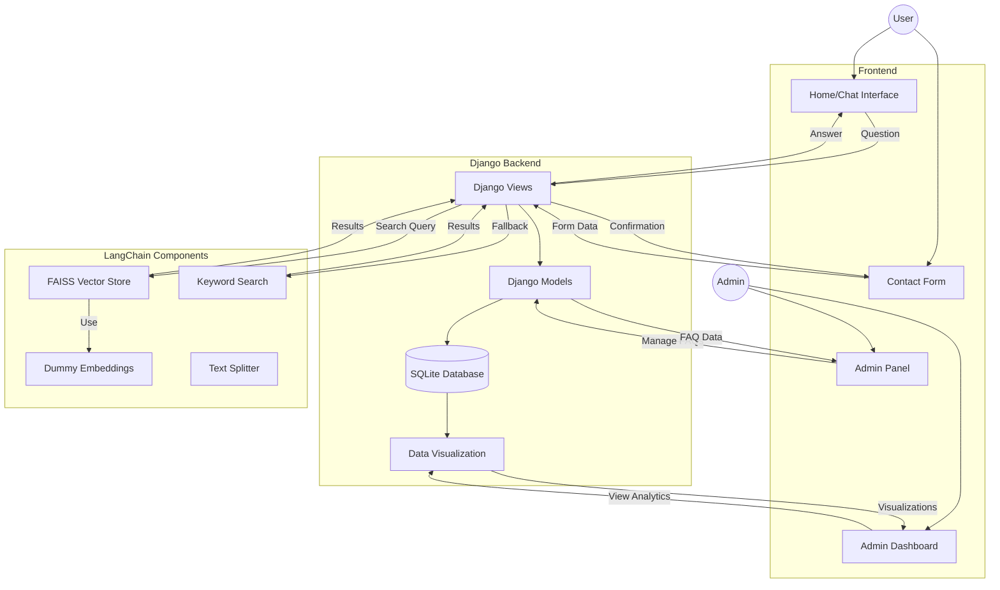

# 🤖 AskGPT

A fully local Django web application for FAQ-based Q&A using LangChain without any LLMs or external services.

## 📋 Overview

AskGPT is a fully local Django web application for FAQ-based Q&A. It uses LangChain core tools without any LLMs or external services. The application allows administrators to manage FAQs through the Django admin panel and provides users with a chat interface to ask questions.

## 🏗️ System Architecture



## ✨ Features

### 👨‍💼 Admin Side
- 📝 Manage FAQs through Django admin panel
  - ➕ Add questions with answers and keywords
  - 🔍 Search and filter FAQs
  - 🕒 Track creation and update timestamps
- 📊 View and manage contact form submissions
- 🛠️ Custom admin panels with search and filtering capabilities
- 📈 Data visualization dashboard with:
  - 📊 Statistics cards showing counts of FAQs, contacts, queries, and follow-ups
  - 📈 Line chart for user queries over time
  - 📊 Bar chart for contact submissions
  - 📊 Bar chart for FAQs added by month
  - 🥧 Pie chart for query follow-up status distribution

### 👥 User Side
- **🏠 Home Page (Chat Interface)**
  - 📋 User registration form (name, email, phone)
  - ✅ Terms of service agreement
  - 💬 Chat interface for asking questions
  - ⚡ Real-time responses using AJAX

- **📞 Contact Page**
  - 📝 Simple contact form
  - 👤 Name, email, phone, and message fields
  - ✅ Form validation and success messages

## 🛠️ Technology Stack

- **🔙 Backend**: Django 5.x with SQLite3
- **🔝 Frontend**: HTML, CSS, JavaScript, Bootstrap 5 (via CDN)
- **📊 Data Visualization**: Matplotlib, Pandas
- **⚙️ LangChain Components**:
  - `langchain_text_splitters` for text chunking
  - `langchain_community.vectorstores.FAISS` with dummy embeddings
  - Keyword-based search as fallback
- **💾 Database**: SQLite3 (Django default)

## 🧩 Components

### 1. 🔙 Backend (Django)

#### 📊 Models
- **❓ FAQ Model**: Stores questions, answers, and keywords for the FAQ system
  - Fields: question, answer, keywords, created_at, updated_at
- **📞 Contact Model**: Stores contact form submissions
  - Fields: name, email, phone, message, created_at
- **❓ UserQuery Model**: Stores user questions and responses
  - Fields: name, email, phone, question, answer, needs_followup, created_at

#### 🖥️ Views
- **🏠 Home View**: Handles user registration and chat interface
  - User registration form
  - Chat interface with AJAX for question handling
- **📞 Contact View**: Handles contact form submissions

#### 👨‍💼 Admin Interface
- Custom admin panels for FAQ, Contact, and UserQuery models
- Search and filtering capabilities
- Interactive dashboard with data visualizations

### 2. ⚙️ LangChain Integration

#### 📄 Text Processing
- `CharacterTextSplitter` for text chunking (if needed)

#### 🔍 Vector Search
- `FAISS` vector store with dummy embeddings
  - No actual embeddings are used (fully local)
  - Random vectors with consistent dimensions

#### 🔤 Fallback Search
- Keyword-based search as fallback
- Simple scoring system based on:
  - Exact keyword matches
  - Word matches in questions and answers

### 3. 🔝 Frontend

#### 📝 Templates
- `base.html`: Base template with common layout
- `home.html`: Chat interface and user registration
- `contact.html`: Contact form
- `admin/dashboard.html`: Admin dashboard with data visualizations

#### 🎨 Styling
- Bootstrap 5 via CDN
- Responsive design
- Custom CSS for chat interface and dashboard

#### 📱 JavaScript
- AJAX for asynchronous chat interaction
- jQuery for DOM manipulation
- Dashboard animations and interactivity

### 4. 📊 Data Visualization

#### 📈 Dashboard Components
- Statistics cards showing key metrics
- Line chart for user queries over time
- Bar chart for contact submissions
- Bar chart for FAQs added by month
- Pie chart for query follow-up status distribution

#### 🔧 Technologies Used
- Matplotlib for chart generation
- Pandas for data processing
- Django's ORM for data querying
- Bootstrap for responsive layout

## 🚀 Installation

1. Clone the repository:
   ```bash
   git clone https://github.com/cyberwithaman/askgpt.git
   cd askgpt
   ```

2. Create a virtual environment and activate it:
   ```bash
   python -m venv venv
   venv\Scripts\activate
   ```

3. Install dependencies:
   ```bash
   pip install -r requirements.txt
   ```

4. Run migrations:
   ```bash
   python manage.py migrate
   ```

5. Create a superuser:
   ```bash
   python manage.py createsuperuser
   ```

6. Run the development server:
   ```bash
   python manage.py runserver
   ```

7. Access the application:
   - 👨‍💼 Admin panel: http://localhost:8000/admin/
   - 📊 Admin dashboard: http://localhost:8000/admin/dashboard/
   - 🏠 Home page: http://localhost:8000/
   - 📞 Contact page: http://localhost:8000/contact/

## 📖 Usage

### 👨‍💼 Admin Tasks
1. Log in to the admin panel
2. Navigate to the FAQs section
3. Add new FAQs with:
   - ❓ Question
   - 💬 Answer
   - 🏷️ Keywords (comma-separated)
4. View and manage contact form submissions
5. Check the dashboard for data visualizations and analytics

### 👥 User Tasks
1. Visit the home page
2. Register with name, email, and phone
3. Accept terms of service
4. Start asking questions in the chat interface
5. Use the contact page to send messages to the admin

## 📊 Sample Data Generation

To populate the application with sample data for testing:

```bash
python sample_data.py
```

This will create:
- Sample FAQs with various creation dates
- Sample contact form submissions
- Sample user queries (some requiring follow-up)

## ⚙️ How It Works

### 🔄 Data Flow

1. **👨‍💼 Admin Flow**:
   - Admin creates FAQs through Django admin panel
   - FAQs are stored in the database
   - Admin can view analytics on the dashboard

2. **📝 User Registration Flow**:
   - User provides name, email, and phone
   - User agrees to terms of service
   - Information stored in session

3. **💬 Chat Flow**:
   - User submits a question via chat interface
   - Question is sent to server via AJAX
   - Server attempts FAISS search with dummy embeddings
   - If FAISS fails, fallback to keyword search
   - Best matching FAQ is returned to user
   - Response is displayed in chat interface

4. **📞 Contact Flow**:
   - User submits contact form
   - Form data is validated
   - Contact is stored in database
   - Success message is displayed

5. **📊 Dashboard Flow**:
   - Admin accesses the dashboard
   - System queries the database for metrics
   - Data is processed using Pandas
   - Charts are generated using Matplotlib
   - Visualizations are displayed in the dashboard

### 🔍 FAQ Matching Process

1. **🔝 Primary Method - FAISS Vector Search**:
   - The application uses FAISS with dummy embeddings to find similar questions
   - Random vectors with consistent dimensions (no actual embeddings used)
   - Fully local operation

2. **🔙 Fallback Method - Keyword Search**:
   - If FAISS fails, it falls back to keyword-based search
   - Keywords from the FAQ are matched against the user's question
   - A scoring system ranks matches based on keyword overlap and word matches

3. **🔒 No External Services**:
   - All processing happens locally
   - No LLMs or embedding models are used
   - No API calls to external services
   - Fully offline operation

## 📁 Project Structure

```
askgpt/
├── askgpt/                # Django project folder
│   ├── __init__.py
│   ├── asgi.py
│   ├── settings.py        # Django settings
│   ├── urls.py            # URL configuration
│   └── wsgi.py
├── askgptapp/             # Main application folder
│   ├── __init__.py
│   ├── admin.py           # Admin panel configuration
│   ├── apps.py
│   ├── models.py          # Database models
│   ├── tests.py
│   ├── urls.py            # App URL configuration
│   └── views.py           # View functions
├── static/                # Static files (CSS, JS)
│   ├── css/
│   └── js/
├── templates/             # HTML templates
│   ├── admin/
│   │   └── dashboard.html # Admin dashboard template
│   ├── base.html
│   ├── home.html
│   └── contact.html
│   
├── sample_data.py     # Sample data generation script
├── manage.py              # Django management script
└── requirements.txt       # Project dependencies
```
## 👤 Author
<strong>Aman Anil (cyberwithaman)</strong>

<a href="mailto:amananiloffial@gmail.com"></a>
<a href="tel:+917892939127"></a>
<a href="https://www.instagram.com/cyberwithaman"></a>
<a href="https://wa.me/+917892939127"></a>
<a href="https://github.com/cyberwithaman"></a>
<a href="https://www.linkedin.com/in/cyberwithaman"></a>

<div align="center">
  <strong>Made by ❤️‍🔥 Aman Anil (cyberwithaman) ❤️‍🔥</strong>
</div>
